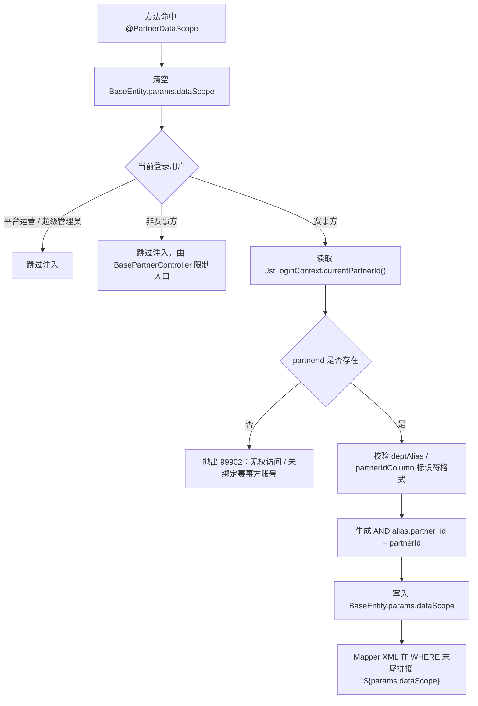

# E2-PA-9 PartnerScope 数据隔离切面（后端）交付报告

## 1. 任务结论

- 已完成 `jst-common` 层的赛事方 SQL 级数据隔离基础设施：`@PartnerDataScope`、`PartnerDataScopeAspect`、`PartnerScopeUtils`、`BasePartnerController`。
- 已补充 `jst-common` 单元测试与测试依赖，覆盖赛事方 A/B、平台运营跳过、非赛事方拒绝、未绑定赛事方拒绝等关键场景。
- 已新增架构说明文档 [35-PartnerScope切面使用说明.md](D:/coding/jst_v1/架构设计/35-PartnerScope切面使用说明.md)，并同步更新 [13-技术栈与依赖清单.md](D:/coding/jst_v1/架构设计/13-技术栈与依赖清单.md)、[16-安全与敏感字段.md](D:/coding/jst_v1/架构设计/16-安全与敏感字段.md)、[29-赛事方Web工作台架构.md](D:/coding/jst_v1/架构设计/29-赛事方Web工作台架构.md)。
- 兼容策略已明确：旧 `@PartnerScope(field = "partnerId")` 保留给存量接口，新接口优先使用 `@PartnerDataScope` 的 SQL 注入方案。

## 2. 交付物清单

### 2.1 新增文件

- `RuoYi-Vue/jst-common/src/main/java/com/ruoyi/jst/common/annotation/PartnerDataScope.java`
- `RuoYi-Vue/jst-common/src/main/java/com/ruoyi/jst/common/aspectj/PartnerDataScopeAspect.java`
- `RuoYi-Vue/jst-common/src/main/java/com/ruoyi/jst/common/controller/BasePartnerController.java`
- `RuoYi-Vue/jst-common/src/main/java/com/ruoyi/jst/common/util/PartnerScopeUtils.java`
- `RuoYi-Vue/jst-common/src/test/java/com/ruoyi/jst/common/aspectj/PartnerDataScopeAspectTest.java`
- `架构设计/35-PartnerScope切面使用说明.md`

### 2.2 修改文件

- `RuoYi-Vue/jst-common/pom.xml`
- `架构设计/13-技术栈与依赖清单.md`
- `架构设计/16-安全与敏感字段.md`
- `架构设计/29-赛事方Web工作台架构.md`

## 3. 关键实现说明

### 3.1 新切面的职责

`PartnerDataScopeAspect` 的执行顺序是：

1. 先清空当前 `BaseEntity.params.dataScope`
2. 读取当前登录用户
3. 平台运营 / 超级管理员直接跳过
4. 非赛事方角色直接跳过，赛事方入口由 `BasePartnerController` 负责兜住
5. 赛事方角色强制读取 `JstLoginContext.currentPartnerId()`
6. 生成安全 SQL：`AND alias.partner_id = currentPartnerId`
7. 写回 `BaseEntity.params.dataScope`

### 3.2 与任务卡命名差异的处理

任务卡原始伪代码使用的是 `organizer_id` / `getOrganizerIdByUserId(...)` 命名，但仓库现状已经统一为 `partner_id` / `JstLoginContext.currentPartnerId()`。

本次实现采用“仓库现状优先、兼容任务卡命名”的方案：

- `PartnerDataScope` 默认字段名使用 `partnerIdColumn = "partner_id"`
- 同时保留 `organizerIdColumn()` 兼容属性；若填写该值，则优先覆盖 `partnerIdColumn`
- 不额外查库，直接复用现有登录上下文中的 `partnerId`

### 3.3 为什么保留旧 `@PartnerScope`

当前仓库仍有多处历史 Controller 依赖“切面反射覆盖 DTO.partnerId”的旧实现。任务卡又明确不允许在本卡里改业务 Mapper XML，因此本次没有强行迁移存量业务接口，而是采用并行方案：

- 旧 `@PartnerScope`：继续服务存量接口
- 新 `@PartnerDataScope`：提供给后续 PA-3 ~ PA-7 业务卡接入

这样可以先把基础设施交付出去，不阻塞后续业务卡逐步迁移。

## 4. 切面工作流图



## 5. 测试与验证

### 5.1 Maven Compile

执行命令：

```bash
cd D:/coding/jst_v1/RuoYi-Vue
mvn -pl jst-common -am compile
```

结果：

- `BUILD SUCCESS`
- `Total time: 10.136 s`

### 5.2 Maven Test

执行命令：

```bash
cd D:/coding/jst_v1/RuoYi-Vue
mvn -pl jst-common -am test
```

结果：

- `BUILD SUCCESS`
- `Total time: 51.242 s`
- `Tests run: 6, Failures: 0, Errors: 0, Skipped: 0`

### 5.3 本次覆盖的测试场景

| 测试项 | 结果 | 说明 |
|---|---|---|
| partner A 登录注入 | 通过 | 自动写入 `AND c.partner_id = 2001` |
| partner B 登录注入 | 通过 | 自动写入 `AND c.partner_id = 2002` |
| `organizerIdColumn` 兼容属性 | 通过 | 可写入 `AND o.organizer_id = 2003` |
| 平台运营跳过注入 | 通过 | `params.dataScope` 保持空串 |
| 非赛事方读取当前 partnerId | 通过 | 抛 `99902` |
| 赛事方未绑定 partnerId | 通过 | 抛 `99902` + 明确错误信息 |

## 6. 遗留事项 / 后续接入要求

- 本卡没有改任何业务模块的 Mapper XML；后续 PA-3 ~ PA-7 接入时，需要在对应查询 XML 的 `WHERE` 末尾补：

```xml
<if test="params.dataScope != null and params.dataScope != ''">
    ${params.dataScope}
</if>
```

- 本卡没有批量改造各业务查询 DTO 继承 `BaseEntity`；后续业务卡若要接 `@PartnerDataScope`，对应 DTO 必须先具备 `params` 容器。
- 旧 `@PartnerScope` 仍留在仓库中，迁移期间同一个接口不要同时叠加 `@PartnerScope` 和 `@PartnerDataScope`。

## 7. 任务卡之外补充完成的内容

- 额外给 `PartnerDataScope` 增加了 `organizerIdColumn()` 兼容属性，减少任务卡命名与仓库现状（`partner_id`）之间的割裂。
- 额外把相关架构文档一并补齐，避免后续任务卡继续按照旧“DTO 回填”口径开发。
- 额外在 `jst-common` 中引入了 `spring-boot-starter-test`，让后续同模块基础设施任务可以继续补充单测。
