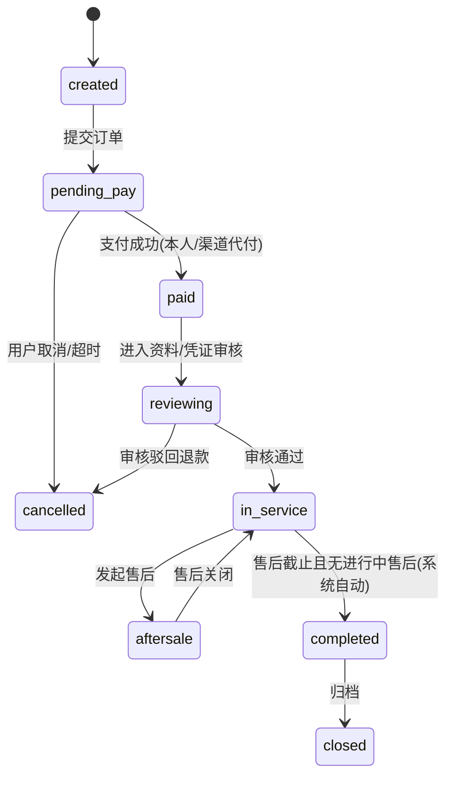
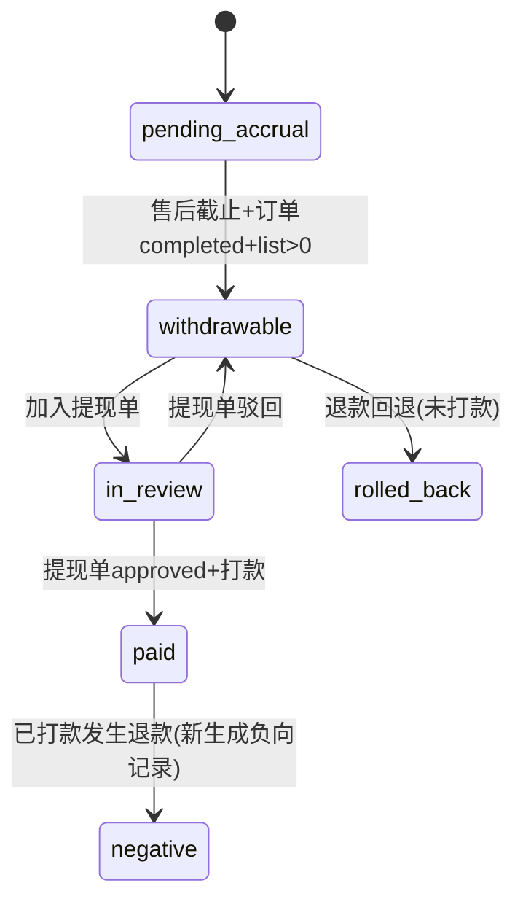
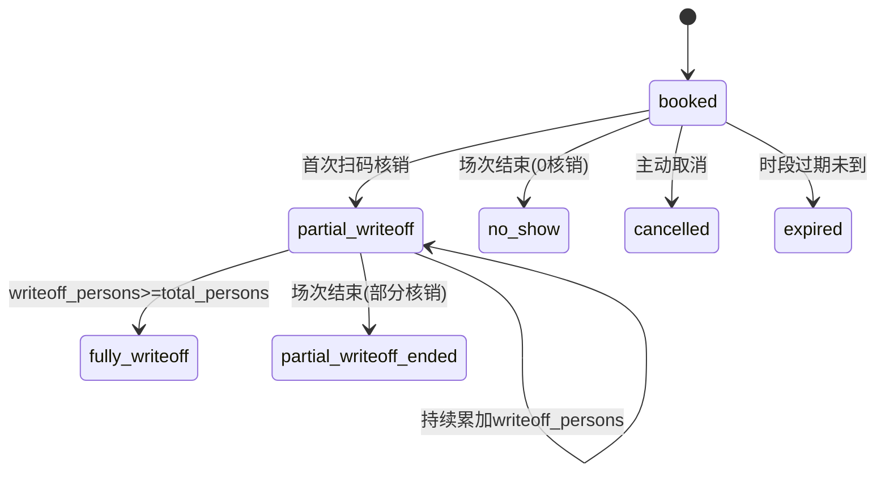

# 竞赛通 V4.1 — 业务状态机定义

> 来源：PRD V4.1 + 数据模型提取报告
> 用途：服务层 StateMachine 实现的契约依据；非法跃迁必须抛 `BusinessException`
> 命名约定：所有状态值 = 数据库字段实际枚举字符串（小写下划线）

---

## 索引

| 编号 | 状态机 | 表 / 字段 | 节点数 |
|---|---|---|---|
| SM-1  | 订单主状态 | jst_order_main.order_status | 9 |
| SM-2  | 退款单 | jst_refund_record.status | 6 |
| SM-3  | 渠道认证 | jst_channel.auth_status | 4 |
| SM-4  | 赛事方入驻 | jst_event_partner_apply.apply_status | 5 |
| SM-5  | 赛事审核+业务 | jst_contest.audit_status / status | 6+6 |
| SM-6  | 报名审核 | jst_enroll_record.audit_status | 4 |
| SM-7  | 转账凭证审核 | jst_payment_record.voucher_audit_status | 3 |
| SM-8  | 返点台账 | jst_rebate_ledger.status | 6 |
| SM-9  | 渠道提现 | jst_rebate_settlement.status | 5 |
| SM-10 | 赛事方结算 | jst_event_settlement.status | 5 |
| SM-11 | 个人预约主状态 | jst_appointment_record.main_status | 8 |
| SM-12 | 核销子项 | jst_appointment_writeoff_item.status | 4 |
| SM-13 | 团队预约（核心） | jst_team_appointment.status | 7 |
| SM-14 | 临时档案认领 | jst_participant.claim_status | 4 |
| SM-15 | 学生-渠道绑定 | jst_student_channel_binding.status | 4 |
| SM-16 | 优惠券 | jst_user_coupon.status | 5 |
| SM-17 | 用户权益 | jst_user_rights.status | 5 |
| SM-18 | 兑换订单 | jst_mall_exchange_order.status | 7 |
| SM-19 | 成绩发布 | jst_score_record.publish_status | 3 |
| SM-20 | 证书发放 | jst_cert_record.issue_status | 3 |
| SM-21 | 课程审核 | jst_course.audit_status | 4 |
| SM-22 | 合同 | jst_contract_record.status | 5 |
| SM-23 | 发票 | jst_invoice_record.status | 6 |
| SM-24 | 风险工单 | jst_risk_case.status | 5 |
| SM-25 | 表单模板审核 | jst_enroll_form_template.audit_status | 4 |

---

## SM-1 订单主状态 `jst_order_main.order_status`



**触发条件**
- `pending_pay → paid` 必须在 `@Transactional` 内同时：写 payment_record、扣积分/冻结优惠券、按 item 分摊金额、写 rebate_ledger=pending_accrual
- `in_service → completed` 由定时任务扫描 `aftersale_deadline < now() AND refund 无 in-flight`
- 任何 → cancelled 必须触发资金回退顺序（见 SM-2）

---

## SM-2 退款单 `jst_refund_record.status`

```
pending → approved → refunding → completed
   ↓
rejected → closed
```

**资金回退顺序（必须事务）**：现金 → 积分 → 优惠券（仅整单全退且原券有效期内）

**联动**
- `completed` 时联动 `order_main.refund_status` 置 partial / full
- 已计提 `rebate_ledger` 状态置 `rolled_back`；已打款则新增 `negative` 记录

---

## SM-3 渠道认证 `jst_channel.auth_status`
`pending → approved`、`pending → rejected`、`approved → suspended`（启停）

## SM-4 赛事方入驻 `jst_event_partner_apply.apply_status`
`draft → pending → (approved | rejected | supplement)`；`supplement → pending`（重提）

## SM-5 赛事 `jst_contest`
- 审核：`draft → pending → (approved | rejected) → online → offline`
- 业务：`not_started → enrolling → closed → scoring → published → ended`
- 业务状态由定时任务+人工触发，与审核状态正交

## SM-6 报名审核 `jst_enroll_record.audit_status`
`pending → (approved | rejected | supplement)`；`supplement → pending`

## SM-7 凭证审核 `jst_payment_record.voucher_audit_status`
`pending → (approved | rejected)`；`rejected → pending`（重传）

---

## SM-8 返点计提台账 `jst_rebate_ledger.status` ⭐



**关键计提条件**：`aftersale_deadline < now()` AND `order_status='completed'` AND `list_amount > 0`

---

## SM-9 渠道提现 `jst_rebate_settlement.status`
`pending → reviewing → (rejected | approved) → paid`

**approved 时**：系统自动按 `channel_id` 锁定，扫描该渠道所有 `negative` 台账，按时间倒序抵扣 `apply_amount`。不足部分结转。必须 Redisson 锁 `lock:rebate:settle:{channelId}`。

## SM-10 赛事方结算 `jst_event_settlement.status`
`pending_confirm → reviewing → (rejected | pending_pay) → paid`

---

## SM-11 个人预约主状态 `jst_appointment_record.main_status`

```
unbooked → booked → (partial_writeoff | fully_writeoff | partial_writeoff_ended | cancelled | expired | no_show)
```

## SM-12 核销子项 `jst_appointment_writeoff_item.status`
`unused → (used | expired | voided)`；**每个子项独立流转，不联动其他子项**

## SM-13 团队预约 `jst_team_appointment.status` ⭐⭐ 核心防雷



**并发约束**
- `writeoff_persons` 任何修改必须持 Redisson 锁 `lock:team_appt:{id}`
- 状态推进基于 `writeoff_persons / total_persons` 比对，必须在锁内
- `partial_writeoff_ended` 是终态，不可再核销（有未核销人数已结算损失）

---

## SM-14 临时档案认领 `jst_participant.claim_status`
```
unclaimed → (auto_claimed | pending_manual)
pending_manual → manual_claimed
任何节点 → unclaimed (管理员撤销)
```
**规则**：
- 自动认领条件：`guardian_mobile + name` 唯一命中 1 条正式用户
- 多候选 / 仅手机号命中 → `pending_manual`
- 撤销时同步 `jst_participant_user_map.status='revoked'`

## SM-15 学生-渠道绑定 `jst_student_channel_binding.status`
`active → (expired | replaced | manual_unbound)`
新绑定生效 → 旧记录置 `replaced`。同一 user_id 同时仅 1 条 active（Redisson 锁 `lock:bind:{userId}` 兜底）

## SM-16 优惠券 `jst_user_coupon.status`
`unused → locked → used`；超时 → `expired`；订单退款 → `refunded`

## SM-17 用户权益 `jst_user_rights.status`
`available → locked → used`；超时 → `expired`；管理员回收 → `revoked`

## SM-18 兑换订单 `jst_mall_exchange_order.status`
`pending_pay → paid → pending_ship → shipped → completed`；旁路 `aftersale / closed`

## SM-19 成绩 `jst_score_record.publish_status`
`unpublished → published → withdrawn`
- 配套 audit_status：`pending → (approved | rejected)`
- `published` 触发证书生成（如有规则）+ 触发售后倒计时

## SM-20 证书 `jst_cert_record.issue_status`
`pending → issued → voided`
特批退款联动作废；`voided` 时同步公开校验码失效

## SM-21 课程审核 `jst_course.audit_status`
`draft → pending → (approved | rejected)`，与 status(on/off) 正交

## SM-22 合同 `jst_contract_record.status`
`draft → pending_sign → signed → (expired | archived)`

## SM-23 发票 `jst_invoice_record.status`
`pending_apply → reviewing → issuing → issued → (red_offset | voided)`

## SM-24 风险工单 `jst_risk_case.status`
`open → assigned → processing → reviewing → closed`

## SM-25 表单模板 `jst_enroll_form_template.audit_status`
`draft → pending → (approved | rejected)`
**重要**：版本号变更不影响历史 `enroll_record.form_snapshot_json`，新版本需审核重新通过

---

## 状态机实现规范（Service 层）

```java
// 推荐使用枚举 + 跃迁矩阵，禁止散落 if-else
public enum OrderStatus {
    CREATED, PENDING_PAY, PAID, REVIEWING, IN_SERVICE,
    AFTERSALE, COMPLETED, CANCELLED, CLOSED;

    private static final Map<OrderStatus, Set<OrderStatus>> ALLOWED = Map.of(
        CREATED,     Set.of(PENDING_PAY, CANCELLED),
        PENDING_PAY, Set.of(PAID, CANCELLED),
        PAID,        Set.of(REVIEWING),
        REVIEWING,   Set.of(IN_SERVICE, CANCELLED),
        IN_SERVICE,  Set.of(AFTERSALE, COMPLETED),
        AFTERSALE,   Set.of(IN_SERVICE),
        COMPLETED,   Set.of(CLOSED)
    );

    public void assertCanTransitTo(OrderStatus target) {
        if (!ALLOWED.getOrDefault(this, Set.of()).contains(target)) {
            throw new ServiceException("非法订单状态跃迁: " + this + "→" + target);
        }
    }
}
```

**强制要求**
1. 所有跃迁必须经过 `assertCanTransitTo`，禁止直接 `setStatus`
2. 资金类跃迁（SM-1、SM-2、SM-8、SM-9、SM-10）必须 `@Transactional(rollbackFor = Exception.class)`
3. 并发类跃迁（SM-13、SM-15、SM-18 库存）必须 Redisson 锁
4. 所有跃迁同步写 `jst_audit_log`（before_json / after_json）
