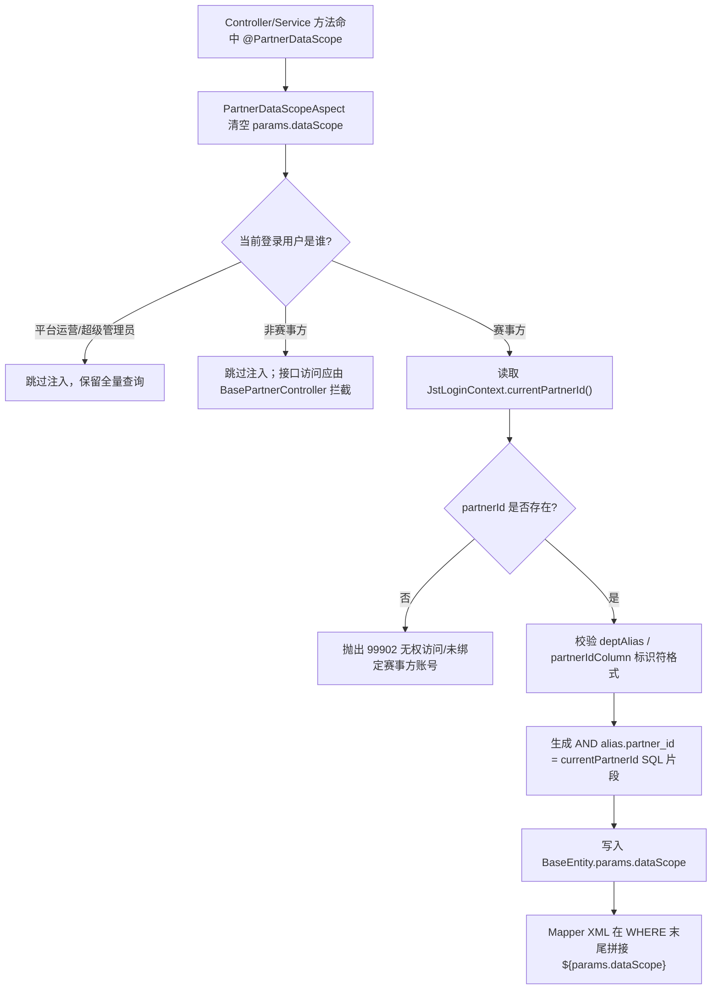

# 35. PartnerScope 切面使用说明
> 适用范围：赛事方 Web 工作台查询接口  
> 生效日期：2026-04-10  
> 目标：把赛事方数据隔离从“覆盖 DTO.partnerId”升级为“SQL 层注入 dataScope”

---

## 1. 能力说明

当前仓库中同时存在两套赛事方数据隔离能力：

| 能力 | 入口 | 作用层级 | 适用场景 |
|---|---|---|---|
| 旧兼容方案 | `@PartnerScope(field = "partnerId")` | DTO 字段回填 | 历史接口、短期兼容 |
| 新推荐方案 | `@PartnerDataScope` | SQL `WHERE` 条件注入 | 2026-04-10 之后新增的赛事方列表/分页查询接口 |

推荐方案会把隔离 SQL 写入 `BaseEntity.params.dataScope`，业务 Mapper XML 再在 `WHERE` 末尾拼接：

```xml
<if test="params.dataScope != null and params.dataScope != ''">
    ${params.dataScope}
</if>
```

---

## 2. 什么时候使用 `@PartnerDataScope`

满足以下条件时，优先使用 `@PartnerDataScope`：

- 接口属于赛事方 Web 工作台，只允许 `jst_partner` 查看自己名下数据。
- 接口是列表、分页、条件检索、多表关联查询。
- 查询入参已经继承 `BaseEntity`，可以承载 `params.dataScope`。
- Mapper XML 可以在 `WHERE` 末尾接入 `${params.dataScope}`。

不适用场景：

- 单条详情、编辑、删除接口。此类接口仍应在 Service 首行做“按 ID 归属校验”。
- 查询 DTO 还没有继承 `BaseEntity`。这时需要在对应业务任务卡里先改 DTO 结构。
- 平台运营后台接口。`PartnerDataScopeAspect` 对 `jst_platform_op` / 超级管理员不生效。

---

## 3. 标准接入步骤

### 3.1 Controller 继承基类

```java
@RestController
@RequestMapping("/jst/event/contest")
public class ContestPartnerController extends BasePartnerController {
}
```

`BasePartnerController` 自带：

- `@PreAuthorize("@ss.hasRole('jst_partner')")`
- `protected Long currentPartnerId()`

### 3.2 查询方法打注解

```java
@PartnerDataScope(deptAlias = "c")
@GetMapping("/list")
public TableDataInfo list(ContestQueryReqDTO query) {
    startPage();
    return getDataTable(contestService.selectPartnerContestList(query));
}
```

参数说明：

| 字段 | 说明 | 默认值 |
|---|---|---|
| `deptAlias` | 受保护主表别名，例如 `c`、`o`、`r` | 空字符串 |
| `partnerIdColumn` | 仓库当前使用的赛事方归属字段 | `partner_id` |
| `organizerIdColumn` | 兼容任务卡早期命名；非空时覆盖 `partnerIdColumn` | 空字符串 |

说明：

- 仓库当前业务表普遍使用 `partner_id`，因此推荐优先填写 `partnerIdColumn`。
- 如果某张表沿用了任务卡中的 `organizer_id` 命名，可填 `organizerIdColumn = "organizer_id"`。

### 3.3 Mapper XML 接入

```xml
<select id="selectPartnerContestList" resultMap="ContestListResult">
    SELECT c.contest_id, c.contest_name, c.status
    FROM jst_contest c
    <where>
        c.deleted = 0
        <if test="contestName != null and contestName != ''">
            AND c.contest_name LIKE CONCAT('%', #{contestName}, '%')
        </if>
        <if test="params.dataScope != null and params.dataScope != ''">
            ${params.dataScope}
        </if>
    </where>
</select>
```

---

## 4. 切面工作流



---

## 5. 安全约束

### 5.1 为什么允许 `${params.dataScope}`

一般 SQL 拼接禁止 `${}`，但 `params.dataScope` 是受控例外，因为它只允许来自切面生成的固定结构：

- 别名和列名必须满足正则：`^[A-Za-z_][A-Za-z0-9_]*$`
- 赛事方 ID 来自服务端登录上下文，不接受前端传入
- 生成结果仅为：`AND alias.partner_id = 123`

因此，业务 XML 只能透传切面产出的 `${params.dataScope}`，不能把前端任意参数塞进这个字段。

### 5.2 仍需保留的越权防线

- 详情/编辑/删除接口：Service 首行做归属校验。
- Controller 权限：继续显式声明 `@PreAuthorize("@ss.hasPermi('...')")`。
- 赛事方入口：继承 `BasePartnerController`，统一要求 `jst_partner` 角色。

---

## 6. 已知限制

### 6.1 仅支持 `BaseEntity`

如果查询 DTO 没有继承 `BaseEntity`，切面找不到 `params` 容器，就不会注入 `dataScope`。这类接口必须在对应业务任务卡里同步完成 DTO 继承改造。

### 6.2 一次调用只处理第一个 `BaseEntity` 参数

当前实现会扫描方法参数并处理第一个 `BaseEntity`。绝大多数列表接口都符合这个约定；如果未来出现多个查询对象同时入参，应重新评估接口签名。

### 6.3 只负责列表 SQL，不替代单条归属校验

`@PartnerDataScope` 不能代替“按 ID 取详情”的归属校验。任何详情、更新、删除、状态流转接口都必须在 Service 中再次验证 `partner_id` 是否属于当前赛事方。

---

## 7. 推荐迁移顺序

1. 先让查询 DTO 继承 `BaseEntity`。
2. Controller 查询方法改为 `@PartnerDataScope`。
3. Mapper XML 在 `WHERE` 末尾接入 `${params.dataScope}`。
4. 保留旧 `@PartnerScope` 直到该模块所有查询接口完成迁移。
5. 详情/编辑/删除接口继续保留 Service 归属校验，不因切面接入而删除。
